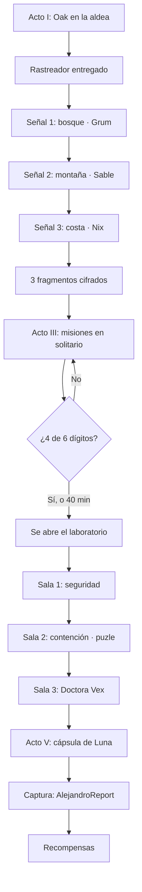
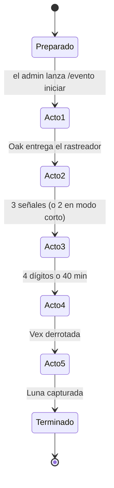
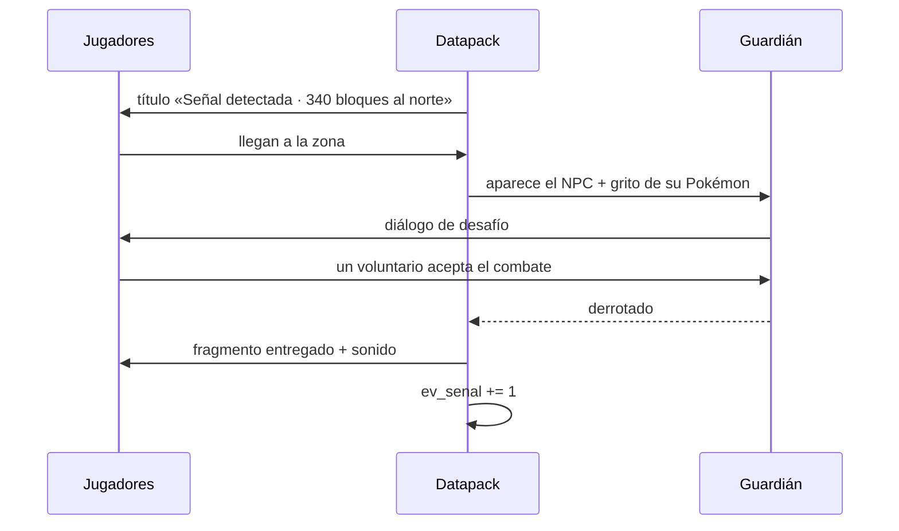

# Evento «El Rastro de Luna»

Diseño completo del evento de historia para PokeReport: Luna Eternal.
Versión 2 — el grupo va unido, y el sistema de audio está resuelto y probado.

---

## 1. Resumen

Un evento de **tres horas** en el que todo el servidor, en grupo, rastrea a Luna
después de que el Equipo Eclipse la secuestre. Cinco actos, seis misiones en solitario
intercaladas, cuatro combates contra NPCs y un jefe final.

Se construye con lo que ya está instalado más tres datapacks y un resourcepack. **No hace
falta ningún mod nuevo.**

### Qué cambió respecto a la primera versión

| | v1 | v2 y por qué |
|---|---|---|
| Estructura del Acto II | El grupo se dividía en tres zonas | **Van todos juntos**, señal por señal. Dividirse deja a la mitad de la gente sin ver los momentos buenos, y en un evento en grupo eso es un error de diseño |
| Duración | 2h 20min | **3h**, consecuencia directa de lo anterior: tres señales seguidas ocupan más que tres en paralelo |
| Audio | Sin resolver | **Resuelto y probado**: TTS neuronal, blips de texto y gritos con licencia |

---

## 2. Decisiones técnicas, verificadas

Nada de esto es suposición: está comprobado leyendo los ficheros del propio juego.

| Necesidad | Solución | Verificación |
|---|---|---|
| NPCs con diálogo | **Sistema nativo de Cobblemon** | Leído su código: `data/cobblemon/npcs/`, `npc_presets/` y `dialogues/`. Soporta páginas, opciones ramificadas, retratos, variables y combate |
| Interfaz | La de Cobblemon | Es la misma pantalla del juego. Se ve integrada, no como un parche |
| Progreso | **Datapack con scoreboards** | Mismo mecanismo que el `/trigger aldeareport` que ya funciona en producción |
| Combates | NPCs con `battleConfiguration` y `party.pool` | El preset define equipo, niveles y dificultad |
| Voz | **Piper + ffmpeg + resourcepack** | Probado de punta a punta: generé a Oak hablando, 62 KB por línea en OGG |
| Gritos | Los 1.074 de Cobblemon | Licencia Creative Commons, ya instalados |

### Tres cosas que costó descubrir

Salieron probando contra el servidor, no leyendo documentación:

1. **Cobblemon no relee los NPCs con `/reload`.** Hace falta **reiniciar** el servidor.
   Con `/reload` el datapack entra pero `/spawnnpc` sigue diciendo «valid NPC
   identifier». Cuesta media hora si no se sabe.
2. **Los NPCs solo se leen del espacio de nombres `cobblemon`**, igual que las especies:
   van en `data/cobblemon/npcs/evento/…` y el ID resultante ignora la subcarpeta
   (`cobblemon:ev_grum`). Un `data/evento/npcs/` propio no lo ve nadie.
3. **`PoolPartyProvider` dejaba a los NPCs sin equipo** (`has no Pokemon on Party`).
   Se usa `SimplePartyProvider`, que además da niveles exactos — mejor para un evento
   guionizado, donde nadie debería encontrarse un jefe distinto al del ensayo.

Y un límite del mod que condiciona el diseño: **`battleConfiguration` no tiene gancho de
derrota** (solo `canChallenge`, `healAfterwards`, `simultaneousBattles`) y MoLang no
expone nada tipo `was_defeated_by`. El NPC **no puede saber que ha perdido**, así que el
avance lo dispara el admin con `/function evento:senales/completar`.

### El sistema de diálogos

Un diálogo es un JSON con `speakers` (con retrato de Pokémon o del jugador), `pages`
(con `id` para saltar), `input` de opción múltiple y `action` en MoLang. Permite
conversaciones ramificadas de verdad.

---

## 3. Sistema de audio

Tres capas que se complementan. Esta es la parte que más va a sorprender a la gente.

### Capa 1 — Blips de texto

Los juegos de Pokémon **nunca tuvieron voces**: tenían el bip por carácter. Es lo que
todo el mundo reconoce al instante. Generados tres: `blip_normal`, `blip_grave` (Oak) y
`blip_agudo` (Vex). Onda cuadrada, 3,8 KB cada uno.

Se disparan por línea de diálogo, no por carácter — Minecraft no da para tanto — pero el
efecto se mantiene.

### Capa 2 — Voz neuronal en los momentos clave

No en todos los diálogos: **solo en los cinco momentos grandes**, uno por acto. Si todo
lleva voz, deja de ser especial y además alarga el evento.

Voces descargadas, libres y latinas:

| Voz | Acento | Para |
|---|---|---|
| `es_MX-claude-high` | México, masculina | **Profesor Oak** |
| `es_MX-ald-medium` | México, masculina | alternativa para Oak |
| `es_AR-daniela-high` | Argentina, femenina | **Doctora Vex** — suena fría, encaja |

Cadena final: **Voicebox** clona la voz, ffmpeg pasa el WAV a OGG Vorbis mono, el
resourcepack lo sirve y el datapack lo dispara. **32 líneas generadas**, 2,1 MB.

### Escenas

Las dos secuencias largas — la llamada del Acto I y la revelación del Acto V — van
encadenadas: cada línea suena, se muestra su subtítulo y el motor espera **lo que dura el
clip** antes de pasar a la siguiente. Las duraciones se miden con ffprobe y se hornean en
el datapack (`evento/datos/duraciones.json`), así que no hay números escritos a mano.

Se lleva con el reloj de un segundo y no con `schedule`: los schedule se pierden en un
`/reload`, y una escena cortada a medias en pleno evento es justo lo que no puede pasar.

Cronometrado en el servidor: la escena del Acto I dura **64 segundos** y se cierra sola.

**El Acto I lanza su escena solo.** La revelación del Acto V no — esa la lanza el admin
con `/function evento:escenas/lanzar_revelacion` cuando el grupo ya está delante de la
cápsula. Es puesta en escena, no algo que deba decidir un reloj.

### Por qué la voz no sale de los diálogos

`run_command` existe en MoLang, pero está registrado en `playerFunctions`: correría con
los permisos del **jugador**, y un jugador normal no puede lanzar `/playsound` ni
`/function`. Por eso las escenas viven en el datapack, que sí corre como servidor.

### Capa 3 — Gritos de Pokémon

1.074 gritos con licencia. Usos previstos:

- **Luna** tiene grito propio, derivado del de Eevee bajándole el tono. Coherente: es de
  donde viene su modelo.
- El **laboratorio** suena de fondo con gritos apagados de Pokémon encerrados.
- Cada **guardián** grita el de su Pokémon estrella al aparecer.

---

## 4. La historia

### Premisa

Luna es un **legendario recién descubierto**, la primera de su especie. El Profesor Oak
la detectó por lecturas de energía anómalas. Antes de poder estudiarla, el **Equipo
Eclipse** la capturó y se la llevó a un laboratorio oculto.

**Eso es lo que el grupo cree durante tres horas.** La verdad sale en el Acto V: Luna es
la **Diosa del Amor Incondicional**, la fuerza que une a todo lo que vive. Arceus dio
origen al universo; ella le dio el motivo para seguir existiendo. Y de todas las formas
que pudo tomar, eligió ser la compañera de un solo entrenador.

Guardar la revelación para el final es deliberado: si Oak lo anuncia en el minuto cinco,
no queda nada por descubrir. Además explica a Vex, que llama a Luna «un error del
universo que voy a corregir» — está intentando borrar el origen de todos los vínculos.

### Acto I — La llamada · 20 min · grupal

Todos en la aldea. Oak aparece junto a la estatua de Luna.

> **OAK** *(con voz)*
> «Entrenadores. Escúchenme bien. Lo que les voy a contar no está en ninguna Pokédex.»
>
> «Hace tres semanas detecté una lectura de energía que no correspondía a ninguna especie
> conocida. Fui a verla. Era una Pokémon… y me miró como si me conociera de toda la vida.»
>
> «La llamé Luna. Iba a estudiarla al día siguiente. No llegué a tiempo.»
>
> «El Equipo Eclipse se la llevó. Y necesito que me ayuden a traerla de vuelta.»

El guion completo, con las veintiocho líneas y sus nombres de fichero, está en
[guion-oak.md](guion-oak.md).

Entrega el **Rastreador de Energía** (una brújula con nombre e historia). El rastreador
marca la primera señal.

### Acto II — Las tres señales · 60 min · grupal, todos juntos

El grupo se mueve **unido** de señal en señal. En cada una:

1. El rastreador vibra y marca la dirección (título en pantalla con la distancia).
2. Al llegar, aparece un **guardián del Eclipse** con su grito de Pokémon.
3. Diálogo corto y desafiante.
4. **Combate**: el guardián reta a un jugador voluntario. El resto mira — y eso es
   bueno: se genera tensión colectiva.
5. Al ganar, suelta un **fragmento de datos cifrado**.

| Señal | Zona | Guardián | Equipo | Fragmento |
|---|---|---|---|---|
| 1ª | Bosque | **Grum** | Poochyena, Mightyena · niv. 25-30 | Coordenada norte |
| 2ª | Montaña | **Sable** | Sneasel, Weavile · niv. 30-35 | Coordenada este |
| 3ª | Costa | **Nix** | Carvanha, Sharpedo · niv. 35-40 | Nivel de profundidad |

Dificultad creciente, y cada guardián deja caer una pista de la personalidad de Vex.

### Acto III — El cifrado · 40 min · individual

Los fragmentos están cifrados. Oak explica que el sistema del Eclipse pide **credenciales
de entrenador experimentado**: hay que demostrar oficio.

Aquí el grupo se dispersa por primera vez, a propósito: es el respiro del evento, después
de una hora juntos. Cada misión completada aporta **un dígito** al código.

**Hacen falta 4 de las 6.** Nadie se queda bloqueado por una que se le atragante.

### Acto IV — El laboratorio · 50 min · grupal

Se abre la entrada. Tres salas:

**Sala 1 — Seguridad.** Dos guardias a la vez. Combate doble.
**Sala 2 — Contención.** Pokémon experimentales en cápsulas. Puzle: hay que desactivar
cuatro palancas en el orden que dicta el código del Acto III. Al fallar, suenan alarmas
y aparece un guardia extra.
**Sala 3 — La Doctora Vex.**

> **VEX** *(con voz)*
> «Así que son ustedes. Los que llevan toda la tarde rompiendo mis cosas.»
>
> «¿Saben lo que tengo aquí? No es un Pokémon. Es una anomalía. Un error del universo
> que yo voy a corregir.»
>
> «Y no, no me interesa su opinión al respecto.»

Combate final: equipo de seis, niveles 45-55. Se enfrenta a **tres jugadores por turnos**
— si cae uno, entra el siguiente. Así participa más gente y no depende de una sola
persona.

### Acto V — El reencuentro · 15 min · grupal

Vex huye. La cápsula queda accesible.

> **OAK** *(con voz)*
> «Ahí está. Ese collar… lo llevaba puesto cuando la encontré.»
>
> «Alejandro. Acércate tú. Creo que lleva todo este tiempo esperándote.»

Luna aparece como Pokémon salvaje **nivel 70**, con su grito propio. Solo
**AlejandroReport** puede capturarla — los demás participan debilitándola.

Al capturarla: fuegos artificiales, mensaje global y recompensas.

---

## 5. Cronograma

Total: **3 horas** más cuarto de hora de margen a cada lado.

| Hora | Bloque | Duración | Tipo |
|---|---|---|---|
| −0:15 | Puertas abiertas, la gente entra | 15 min | — |
| 0:00 | **Acto I** — La llamada | 20 min | Grupal |
| 0:20 | **Acto II** — Señal 1ª, bosque | 20 min | Grupal |
| 0:40 | **Acto II** — Señal 2ª, montaña | 20 min | Grupal |
| 1:00 | **Acto II** — Señal 3ª, costa | 20 min | Grupal |
| 1:20 | Descanso anunciado | 10 min | — |
| 1:30 | **Acto III** — El cifrado | 40 min | Individual |
| 2:10 | **Acto IV** — El laboratorio | 50 min | Grupal |
| 3:00 | **Acto V** — El reencuentro | 15 min | Grupal |
| 3:15 | Recompensas, fotos, cierre | 15 min | — |

### Regla de oro de los tiempos

**Ningún reloj puede impedir que el evento termine.** Los límites empujan, no cortan:

- **Acto II**: si una señal pasa de 25 min, Oak «recalibra» y el guardián se rinde.
- **Acto III**: a los 40 min el código se completa solo, con excusa narrativa —
  Oak descifra el resto.
- **Acto IV**: sin límite. Es el clímax, se le da lo que pida.

### Modo corto

Si el día del evento hay poca gente o va con retraso, **se salta la señal de la costa**.
El evento baja a **2h 20min** y la historia sigue funcionando: dos coordenadas y Oak
deduce la tercera. Está previsto en el datapack con un interruptor.

---

## 6. Diagramas

### Flujo general



### Estado del evento



### Secuencia de una señal



---

## 7. Misiones en solitario

Seis, de estilos deliberadamente distintos para que nadie quede fuera. Cada una da un
dígito; hacen falta cuatro.

| # | Nombre | Requisito | Cómo se detecta |
|---|---|---|---|
| 1 | **Cazador nocturno** | Captura 3 Pokémon de tipo Siniestro | Avance con **69 alternativas**, una por especie siniestra |
| 2 | **Corazón de hielo** | Captura 1 de tipo Hielo | Igual, con **48 especies** |
| 3 | **Veterano** | Gana 5 combates | `cobblemon:battles_won` |
| 4 | **Coleccionista** | Sube 3 Pokémon a nivel 40 | `cobblemon:level_up` |
| 5 | **Sabueso** | Encuentra 5 balizas escondidas | Datapack: detecta al acercarse a 5 bloques |
| 6 | **Pescador** | Pesca 10 Pokémon | `cobblemon:reel_in_pokemon` |

**Lo que hubo que cambiar del diseño original y por qué.** Cobblemon filtra por
**especie**, nunca por tipo ni por nivel — se comprobó leyendo `PartyCheckCriterion`, que
trabaja sobre `Species`. De ahí dos consecuencias:

- Los filtros de nivel («siniestro de nivel 25+») **no se pueden expresar** y se han
  quitado. En la práctica da igual: en el Acto III la gente ya lleva equipo alto.
- Los de tipo se resuelven **enumerando especies**. La lista sale del propio jar del mod
  a `evento/datos/tipos_cobblemon.json` (1.025 especies leídas), no escrita a mano, así
  que si Cobblemon añade siniestros basta regenerar.

Las balizas se colocan en vivo con `/function evento:admin/poner_baliza` donde esté el
admin, en vez de con coordenadas fijas en el código.

Las balizas de la misión 5 son la excusa perfecta para que recorran zonas construidas
por la comunidad.

---

## 8. Arquitectura técnica

```
Evento-DP.zip                        motor del evento
  data/evento/function/
    cargar.mcfunction                crea los marcadores
    reloj.mcfunction                 tick: condiciones y tiempos
    admin/{iniciar,saltar,reiniciar,modo_corto}.mcfunction
    actos/{a1,a2,a3,a4,a5}.mcfunction
    senales/{s1,s2,s3}.mcfunction
    misiones/{m1..m6}.mcfunction
    lab/{sala1,sala2,sala3,puzle}.mcfunction
  data/minecraft/tags/function/{load,tick}.json

Evento-Datos-DP.zip                  NPCs y diálogos
  data/cobblemon/npcs/{oak,grum,sable,nix,guardia,vex}.json
  data/cobblemon/npc_presets/…
  data/cobblemon/dialogues/…         un fichero por conversación

Evento-RP.zip                        audio
  assets/evento/sounds/voz/…         líneas con voz
  assets/evento/sounds/ui/blip_*.ogg
  assets/evento/sounds/luna_cry.ogg
  assets/evento/sounds.json
```

### Marcadores

```
ev_estado      0-5     acto en curso (global, en la entidad "evento")
ev_reloj       ticks   cronómetro del acto
ev_senal       0-3     señales completadas
ev_codigo      0-6     dígitos reunidos
ev_modo        0/1     0 = completo, 1 = corto
ev_acto        0-5     progreso individual de cada jugador
ev_m1..ev_m6   0/1     misiones por jugador
ev_baliza      0-5     balizas encontradas por jugador
```

---

## 9. Pseudocódigo

### Bucle principal

```
funcion reloj():
    ev_reloj += 1

    segun ev_estado:
        caso 2:                                  # las señales
            si ev_senal >= (2 si ev_modo else 3):
                avanzar(3)
            si ev_reloj > 25min:
                rendir_guardian_actual()
                anunciar("Oak: 'He recalibrado el rastreador'")

        caso 3:                                  # el cifrado
            para cada jugador: comprobar_misiones(jugador)
            si ev_codigo >= 4 o ev_reloj > 40min:
                si ev_reloj > 40min:
                    anunciar("Oak ha descifrado el resto")
                avanzar(4)

        caso 4:                                  # laboratorio, sin límite
            si vex_derrotada(): avanzar(5)

        caso 5:
            si luna_capturada(): terminar()
```

### Avance de acto

```
funcion avanzar(n):
    ev_estado = n
    ev_reloj = 0
    para cada jugador conectado:
        jugador.ev_acto = n
        titulo(jugador, "ACTO " + romano(n), subtitulo[n])
        sonido(jugador, "evento:voz/acto" + n)
    activar_npcs(n)
    desactivar_npcs(n - 1)
    log_admin("Acto " + n + " iniciado")
```

### Comprobación de misión

```
funcion comprobar_mision(jugador, n):
    si jugador["ev_m" + n] == 1: return          # ya hecha

    si condicion_cumplida(jugador, n):
        jugador["ev_m" + n] = 1
        ev_codigo += 1
        titulo(jugador, "FRAGMENTO DESCIFRADO", "Dígito " + ev_codigo + " de 4")
        sonido(jugador, "evento:ui/fragmento")
        anunciar(jugador + " ha descifrado un fragmento (" + ev_codigo + "/4)")
```

### Puzle de la sala 2

```
funcion palanca_activada(jugador, numero):
    si numero == siguiente_esperado:
        siguiente_esperado += 1
        sonido_todos("evento:ui/correcto")
        si siguiente_esperado > 4:
            abrir_puerta_sala3()
    sino:
        siguiente_esperado = 1
        sonido_todos("evento:ui/alarma")
        aparecer_guardia_extra()
        anunciar("¡Alarma! Secuencia incorrecta")
```

---

## 10. Recompensas

| Logro | Recompensa |
|---|---|
| Participar | Medalla conmemorativa + título `[Rastreador]` en el chat |
| Completar 4 misiones | Master Ball |
| Derrotar a un guardián | Poké Balls raras y CobbleDollars |
| Derrotar a Vex | Objeto único: **Collar de Luna** (cosmético) |
| Capturar a Luna | La propia Luna, para Alejandro |

El título en el chat se monta con lo que ya está: un grupo de LuckPerms y un estilo de
Styled Chat, igual que el de `[STREAMER]`.

---

## 11. Plan de implementación

| Fase | Qué | Quién | Estado |
|---|---|---|---|
| 0 | Investigación técnica y audio | yo | **hecho** |
| 1 | Datapack motor: marcadores, actos, tiempos | yo | **hecho y probado en el servidor** |
| 2 | NPCs: Oak, 3 guardianes, guardia, Vex | yo | **hecho y probado en el servidor** |
| 3 | Diálogos y escenas con voz | yo | **hecho y probado en el servidor** |
| 4 | Las 6 misiones | yo | **hecho y probado en el servidor** |
| 5 | Voces de Oak: 32 líneas generadas y empaquetadas | tú + yo | **hecho** (falta rehacer `a2_05`) |
| 6 | **Construir escenarios**: 3 señales + laboratorio | **tú y el equipo** | pendiente |
| 7 | Panel de admin y guion del día ([runbook-evento.md](runbook-evento.md)) | yo | **hecho y probado** |
| 8 | **Prueba completa con 2-3 personas** | ambos | pendiente |

La fase 6 es el cuello de botella y es vuestra. Yo puedo generar estructuras, pero un
laboratorio construido a mano va a lucir infinitamente más.

---

## 12. Guion de operación del día

Lo que hace el admin, en orden:

Un datapack de vainilla **no puede registrar comandos propios**, así que no hay
`/evento iniciar`: se llaman con `/function`. Funcionan igual y no hacen falta mods.

```
1. /whitelist off                                  abrir el servidor
2. /function evento:admin/estado                   ver cómo está todo
3. /function evento:admin/iniciar                  empezar, con la gente dentro
4. /function evento:admin/saltar                   si un acto se atasca
5. /function evento:admin/reiniciar                empezar de cero
6. /function evento:admin/modo_corto               si vamos con retraso
```

Durante el evento, para enganchar la historia con el motor:

```
/function evento:senales/completar     un guardián ha caído
/function evento:misiones/m1 … m6      un jugador supera una misión
/function evento:lab/vex_derrotada     cae la Doctora Vex
/function evento:actos/terminar        Luna capturada
```

`/function evento:admin/ayuda` los lista todos dentro del juego.

---

## 13. Riesgos y planes B

| Riesgo | Plan B |
|---|---|
| Un combate contra NPC se cuelga | `/evento saltar` da el acto por completado |
| La gente se dispersa en el Acto II | El rastreador da título en pantalla con dirección y distancia cada 30 s |
| Alguien entra a mitad del evento | Al entrar se le pone el acto en curso automáticamente |
| Un jugador se atasca en las misiones | Solo hacen falta 4 de 6, y a los 40 min se completa solo |
| El servidor se cae | Los marcadores se guardan en el mundo: al volver, el evento sigue donde estaba |
| Se descubre el laboratorio antes de tiempo | Se protege con un claim de servidor hasta el Acto IV |

---

## 14. Decisiones pendientes

1. **¿Voz de Oak?** `claude` (calidad alta) o `ald`. Muestras en `docs/muestras-voz/`.
2. **¿Grito de Luna?** `luna_cry` o `luna_cry_grave`.
3. **¿Dónde van las tres señales?** Coordenadas, o las busco con `locate`.
4. **¿El laboratorio se construye o lo genero yo** como estructura base para que
   vosotros lo decoréis?
5. **¿Los guardianes son NPCs o jugadores vuestros** con skin del Eclipse? Lo segundo
   es mucho más vivo y permite improvisar.
6. **¿Fecha?** Determina cuánto hay para construir.
