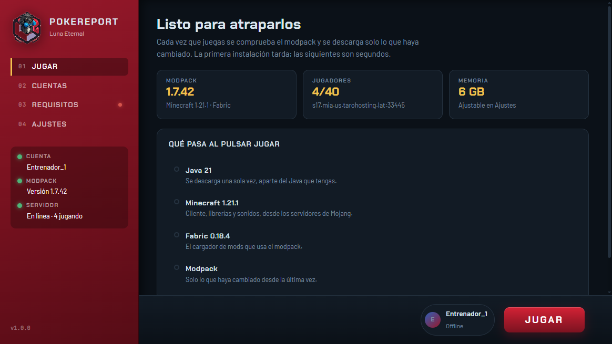

# PokeReport Launcher

Launcher de escritorio para que los 12 entréis al servidor con un botón, sin instalar
nada a mano y con el modpack siempre al día.

Instalador: `launcher/dist/PokeReportLauncher-1.6.0-setup.exe` (96 MB).



## Qué hace

1. Descarga **Java 21** (aparte del Java que tengas: no toca nada del sistema).
2. Descarga **Minecraft 1.21.1** de los servidores de Mojang.
3. Instala **Fabric 0.18.4**.
4. Sincroniza el **modpack** desde un manifiesto publicado en GitHub.
5. Lanza el juego, que **abre en el menú**.

Entrar al servidor es el botón **Conectarse a PokeReport** del propio menú del juego.
El launcher no conecta solo a propósito: hacerlo no dejaba ni cambiar las opciones, y
en un PC justo parecía que se había colgado.

Los cuatro pasos se ven en pantalla y se van encendiendo, así se sabe dónde está
tardando en vez de mirar una barra opaca.

## Lo que lo hace rápido

- **Solo baja lo que cambia.** Cada fichero lleva su SHA1 en el manifiesto; el launcher
  compara con lo que hay en disco. La primera instalación baja ~915 MB, las siguientes
  suelen ser unos pocos MB.
- **El hash se calcula mientras se descarga**, no releyendo el fichero después. Con
  ~4000 assets de Minecraft eso es la diferencia entre segundos y minutos.
- **16 descargas a la vez** con reintentos y retroceso exponencial.
- **Escritura atómica**: se baja a `.part` y se renombra al terminar, así una descarga
  cortada nunca deja un fichero corrupto que parezca bueno.
- **Las carpetas de miles de ficheros viajan como un zip.** El shaderpack son 1234
  ficheros: una petición en vez de mil.
- **Cero dependencias de runtime.** Solo APIs de Node, incluido un lector de ZIP propio.
  Menos peso y nada que se rompa al actualizar paquetes.

## Cuentas

Solo hay **cuentas offline**: pides un nombre y entras. Es lo que corresponde a un
servidor en `online-mode=false`.

Si el jugador ya tenía cuenta de Minecraft y pone **su nombre de siempre**, el
launcher le recupera su skin real de Mojang, así que no pierde nada.

### Tu personaje

En **Cuentas** hay un visor 3D del muñeco. La skin sale, por este orden: la que
elijas tú con **Elegir un PNG** (64x64 o 64x32, validado leyendo la cabecera del
fichero), o **la que tenga tu nombre en Mojang** — así quien ya tenía cuenta
recupera su skin de siempre aunque entre por offline.

Al elegir un PNG, el launcher guarda una copia como `mi-skin.png` en la raíz de la
instancia, para tenerla a mano al subirla. El visor del launcher es solo eso: un
visor. La skin que ven los demás la sirve el servidor.

> **Para que la vean los demás**, dentro del juego, con **SkinRestorer** (va en el
> servidor; el cliente no necesita ningún mod de skins):
>
> - `/skin set mojang <nombre>` — copia la skin de esa cuenta de Minecraft. Con la
>   configuración por defecto esto pasa **solo** al entrar por primera vez
>   (`join.autoFetch`), así que quien ya tenía cuenta no necesita hacer nada.
> - `/skin set web classic "<enlace>"` — un PNG propio. Comillas dobles obligatorias
>   y hay que decir `classic` o `slim`.
> - `/skin reset` vuelve a la de siempre; `/skin refresh` la vuelve a bajar.

### La regla que manda en todo esto

**El cliente de Minecraft solo acepta texturas alojadas en dominios de Mojang.** Si
el perfil trae una URL de cualquier otro sitio, la descarta y pinta la skin por
defecto, sin avisar en pantalla. En el log del cliente se ve así:

```
[Worker-Main-7/ERROR]: Textures payload contains blocked domain: http://ely.by/storage/skins/....png
```

Por eso `/skin set web` **no sirve el enlace que le das**: se lo pasa a MineSkin,
que sube el PNG a una cuenta real y devuelve una URL de `textures.minecraft.net`,
que es la que acaba en el perfil. El enlace que tú das solo tiene que ser legible
**para MineSkin**: PNG directo, público y sin token que caduque.

Sitios que valen: `raw.githubusercontent.com` (el propio repo del pack sirve —
ver [`skins/`](https://github.com/corderovibes-collab/pokereport-luna-eternal/tree/main/skins)),
catbox.moe, cualquier hosting que devuelva el PNG con su `Content-Length`.
Comprobado que **no** vale `ely.by/storage/...`: MineSkin responde
`400 invalid_image` al intentar descargarlo.

> **ely.by no es una opción.** Se probó a fondo: el proveedor `ely.by` integrado usa
> `skinsystem.ely.by/textures/signed/<nombre>`, que hoy devuelve 204 vacío; y un
> proveedor propio contra su API authlib-injector sí trae la skin, pero con la URL
> apuntando a `ely.by`, que es justo lo que el cliente bloquea. Queda configurado
> con `enabled: false` en
> [`server-pack/config/skinrestorer.json`](../server-pack/config/skinrestorer.json)
> por si algún día el launcher monta authlib-injector, que es lo que quita ese
> bloqueo.

La copia del repo lleva `providers.mineskin.apiKey` **en blanco a propósito**; la key
de verdad vive solo en el servidor. Sin ella MineSkin va limitado, así que si se
redespliega esta config hay que volver a ponerla.
> - `/skin set web classic "<enlace>"` — desde una URL directa al PNG. Las **comillas
>   dobles son obligatorias** y hay que indicar `classic` o `slim`.
> - `/skin reset` vuelve a la de siempre; `/skin refresh` la vuelve a bajar.
>
> Con la configuración por defecto (`join.autoFetch.enabled = true`, proveedor
> `mojang`), al entrar por primera vez el servidor busca el nombre en Mojang y le
> pone su skin real a quien ya tuviera cuenta.

### Qué se conserva al actualizar

El launcher solo gestiona `mods/` y los ficheros de marca que ponemos nosotros. **Todo
lo de `config/` pasa a ser del jugador** tras la primera instalación: controles,
ajustes de vídeo, Sodium, volumen del chat de voz y los shaders si los enciendes.

De los 441 ficheros del pack, 215 están marcados como intocables. Así actualizar el
modpack no borra lo que cada uno haya configurado.

> **Aviso importante sobre las cuentas offline:** el UUID se calcula a partir del
> nombre (`OfflinePlayer:<nombre>`, igual que lo hace el servidor). Eso significa que
> **el inventario y los Pokémon van atados al nombre**: si alguien se lo cambia,
> empieza de cero. Que cada uno elija bien a la primera.

### El inicio de sesión con Microsoft está quitado de la interfaz

Se retiró a propósito: necesita un Client ID de Azure **y que Mojang apruebe la
aplicación** (hasta entonces responde 403), y en un servidor offline no aporta nada.
Dejarlo visible solo generaba soporte.

**El motor sigue en el código** (`core/auth.js` y los manejadores de `main.js`), así
que si algún día pasáis a `online-mode=true` y Mojang os aprueba la app, volver a
activarlo es restaurar el panel de Microsoft en `index.html` y su bloque en `app.js`.
El razonamiento completo está en [azure.md](azure.md).

## Publicar y actualizar el pack

Todo el contenido sale de un `manifest.json`. Actualizar el modpack es regenerarlo y
volver a publicarlo: **no hay que repartir un launcher nuevo**.

```bash
cd launcher

# 1) Generar el manifiesto desde el .mrpack oficial
python tools/build_manifest.py \
  --mrpack "../client-pack/COBBLEVERSE 1.7.42.mrpack" \
  --out ../client-pack/manifest.json \
  --payload-dir /ruta/donde/dejar/los/ficheros

# 2) Subirlo todo a GitHub (necesita `gh auth login`)
python tools/publish_github.py \
  --repo TU_USUARIO/cobbleverse-pack \
  --manifest ../client-pack/manifest.json \
  --payload /ruta/donde/dejar/los/ficheros \
  --version 1.7.42
```

El script deja la URL final del manifiesto. Se pega en **Ajustes → Manifiesto del
modpack**, o se fija como valor por defecto en `src/main/main.js`.

### De dónde sale cada cosa

| Origen | Ficheros | Peso |
|---|---|---|
| CDN de Modrinth | 175 (los mods) | 678 MB |
| Release de GitHub | 256 (config, resourcepacks, datapacks, shaders) | 237 MB |

Los mods se dejan en Modrinth a propósito: es más rápido, siempre está al día y no
consume tu cuota de GitHub. Si prefieres tenerlo *todo* en GitHub, el manifiesto
acepta cualquier URL por fichero.

### Añadir o quitar un mod más adelante

1. Cambia el `.mrpack`, o añade el jar a una carpeta y pásala con `--local-mods`.
2. Regenera y republica con los dos comandos de arriba.
3. Los jugadores lo reciben la próxima vez que le den a Jugar. Los mods retirados se
   borran solos.

## Compilar el launcher

```bash
cd launcher
npm install
npm start                 # abrir en modo desarrollo
npm run dist              # instalador en launcher/dist/

npm test                                  # 18 pruebas del núcleo
npm run test:visual                       # render real en Chromium (Playwright)
npx electron tools/preview.mjs accounts   # captura rápida de una vista
```

> Si `electron` arranca como si fuera Node, es que tienes `ELECTRON_RUN_AS_NODE=1` en
> el entorno. Lánzalo con `env -u ELECTRON_RUN_AS_NODE`.

**Para lo visual, fíate de `npm run test:visual`, no del preview de Electron.**
`capturePage` no compone las capas 3D del visor del personaje: el muñeco se ve
perfectamente en la app pero sale en blanco en la captura. Playwright renderiza de
verdad y compara el recorte contra el marco vacío, así que detecta si algo dejó de
dibujarse. Fue lo que destapó que las skins antiguas (64x32) salían con el torso mal.

El instalador **no va firmado** (es privado), así que Windows SmartScreen avisará la
primera vez: *Más información* → *Ejecutar de todas formas*.

## Cómo está montado

```
launcher/
  src/main/core/    net (descargas), zip, java, minecraft, fabric, pack, auth, launch, ping
  src/main/main.js  ventana, IPC y ciclo de vida
  src/preload/      puente cerrado entre la UI y el proceso principal
  src/renderer/     interfaz (HTML/CSS/JS a pelo, sin framework)
  tools/            generar manifiesto, publicar en GitHub, pruebas, capturas
```

Decisiones que conviene conocer si algún día hay que tocarlo:

- **La UI no puede tocar el disco ni la red.** Va con `contextIsolation`, sin Node, y
  solo ve las funciones que expone el preload. Todo el trabajo ocurre en el proceso
  principal.
- **`versions/`, `libraries/` y `assets/` siguen el layout oficial de Mojang**, así que
  los ficheros valen para cualquier otro launcher si algún día se migra.
- **El manifiesto manda sobre la versión de Minecraft y de Fabric.** Si el pack salta a
  1.22, el launcher se adapta solo.
- Los datos viven en `%APPDATA%\.cobbleverse`. Desinstalar es borrar esa carpeta.

## Interfaz

Diseño propio con la idea de **terminal Pokédex**: carcasa roja con los mandos a la
izquierda y una pantalla hundida a la derecha. Los tres pilotos del raíl no decoran:
son estado real (cuenta elegida, versión del pack, y un *ping* de verdad al servidor
que dice si está en línea y cuánta gente hay).

Tipografías empaquetadas (106 KB en total, no se piden a ningún CDN): **Chakra Petch**
para títulos y controles, **Barlow** para el texto y **JetBrains Mono** para códigos,
versiones y registros.
